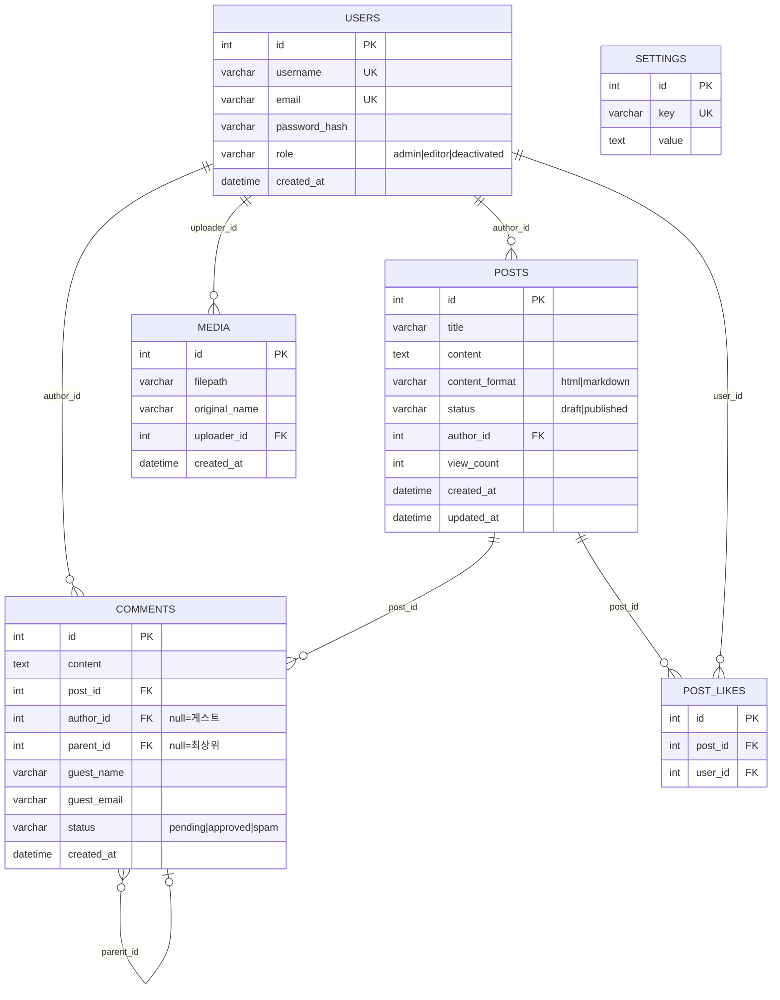

# DB ERD

## 실행 순서

1. `backend/models/` 디렉토리의 도메인별 파일을 Read 도구로 읽는다 (Issue #21 이후 schema.py는 삭제됨)
   - `models/user.py` — User, Follow
   - `models/post.py` — Post, PostMeta, PostLike, VisitLog
   - `models/comment.py` — Comment
   - `models/media.py` — Media
   - `models/category.py` — Category
   - `models/tag.py` — Tag, PostTag
   - `models/series.py` — Series, SeriesPost
   - `models/option.py` — Option, Menu, MenuItem
   - `models/constants.py` — MAX_CATEGORY_DEPTH 등 도메인 상수
2. 모든 모델(테이블), 컬럼, 관계(ForeignKey, relationship)를 파악한다
3. 아래 Mermaid 형식으로 ERD를 출력한다
4. 필요 시 `docs/ERD.md` 파일로 저장한다

---

## Mermaid ERD 형식

````markdown

````

---

## 관계 표기법 (참고)

| 표기 | 의미 |
|------|------|
| `||--||` | 1:1 |
| `||--o{` | 1:N (0 이상) |
| `}o--o{` | N:M |
| `||--|{` | 1:N (1 이상) |

---

## 출력 후 추가 분석

ERD 생성 후 아래 항목을 함께 분석:

1. **인덱스 현황**: 자주 JOIN/WHERE에 쓰이는 FK에 인덱스가 있는지
2. **CASCADE 설정**: 유저 삭제 시 연관 데이터(posts, comments) 처리 방식
3. **미구현 테이블**: roadmap.md의 Phase 1 테이블(`categories`, `tags`, `blogs` 등) 중 아직 없는 것
4. **정규화 이슈**: 중복 데이터나 역정규화 의심 구조

---

## 저장

```bash
# docs/ERD.md로 저장 시
# Write 도구로 docs/ERD.md 생성
```
